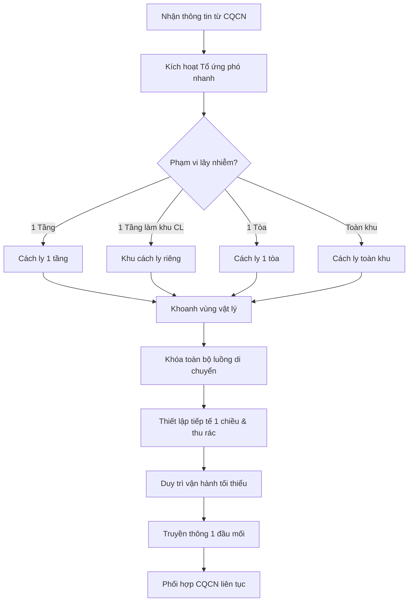
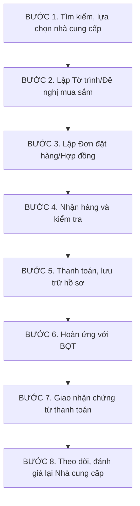

# Crisis Response Flow – Building Management

## Quy trình mua sắm

### BƯỚC 1. Tìm kiếm, lựa chọn nhà cung cấp
- Ban Quản Lý (BQL) liên hệ, tìm hiểu các Nhà cung cấp (NCC) có khả năng đáp ứng được các yêu cầu về số lượng, chất lượng, chủng loại, nguồn gốc xuất xứ, bảo hành và đề nghị NCC báo giá.
- BQL thu thập ít nhất 3 báo giá hoặc theo số lượng Khách hàng yêu cầu mà BQL có thể thu thập (trừ các trường hợp khác) để xem xét, lập bảng so sánh giá, đề xuất lựa chọn NCC phù hợp và gửi mail đề xuất Ban Quản Trị (BQT) duyệt NCC.
- Đề xuất BQT giới thiệu NCC cung cấp khi BQL không tìm đủ 3 báo giá từ các NCC hoặc báo giá quá cao.

### BƯỚC 2. Lập Tờ trình/Đề nghị mua sắm
- BQT xem xét và cho ý kiến sửa đổi hoặc bổ sung (nếu có).
- Thời hạn tối đa 3 ngày từ ngày BQL gửi mail, BQT phê duyệt lựa NCC hoặc không có ý kiến sửa đổi bổ sung, BQL sẽ lập Tờ trình/Đề nghị mua sắm trình BQT ký.

### BƯỚC 3. Lập Đơn đặt hàng/Hợp đồng
- Sau khi BQT phê duyệt NCC, thống nhất mua hàng và ký vào Tờ trình/Đề nghị mua sắm, BQL tiến hành liên hệ NCC để xác định việc mua hàng.
- Trường hợp có nhu cầu ký kết Hợp đồng thì BQL yêu cầu NCC lập hợp đồng mua bán sau đó trình BQT xem xét và ký kết hợp đồng.
- Trường hợp không cần Hợp đồng thì BQL liên hệ với NCC tiến hành việc mua hàng.

### BƯỚC 4. Nhận hàng và kiểm tra
- BQL chuyển Tờ trình/Đề nghị mua sắm và Hợp đồng mua hàng (nếu có) cho Kế toán của BQT.
- BQL liên hệ với NCC để xác định thời điểm giao hàng, thông báo cho Kế toán BQL tiến hành thủ tục thanh toán và các bộ phận có liên quan để chuẩn bị nhập hàng.
- Khi hàng hóa được nhập về Kho BQL, đại diện kỹ thuật BQL có trách nhiệm kiểm tra vật tư, hàng hóa, trang thiết bị về kho. Nếu hàng hóa đúng yêu cầu thì tiến hành nhập kho. Nếu không đúng yêu cầu, đại diện kỹ thuật BQL thông báo ngay cho NCC để thực hiện thay thế.
- Trường hợp phải trả lại hàng hóa cho NCC, cần phải thực hiện ký xác nhận về số lượng/chất lượng/tình trạng hàng hóa khi trả lại.
- Hàng hóa sau khi được đổi lại, đại diện kỹ thuật BQL thực hiện theo trình tự quy định như trên.
- Kết thúc nhập hàng, đại diện kỹ thuật BQL và các phòng ban/bộ phận liên quan có trách nhiệm ký vào Biên bản nghiệm thu, Biên bản giao nhận theo quy định.

### BƯỚC 5. Thanh toán, lưu trữ hồ sơ
- Thành viên phụ trách Kế toán BQT thực hiện thủ tục chi tạm ứng cho BQL/ NCC theo Đơn đặt hàng/Hợp đồng mua bán và lưu trữ hồ sơ kế toán theo quy định.
- BQL tập hợp, lưu trữ các hồ sơ liên quan về công tác mua hàng để hoàn trả BQT bộ gốc.

### BƯỚC 6. Hoàn ứng với BQT
- BQL có trách nhiệm lập đầy đủ bộ hồ sơ hoàn ứng gửi BQT. Bộ hồ sơ hoàn ứng gồm có:
  - Tờ trình/Đề nghị mua sắm có đầy đủ chữ ký phê duyệt của BQT (một chữ ký của đại diện tổ kỹ thuật, một chữ ký của Trưởng Ban Quản Trị).
  - Tờ trình đề nghị thanh toán.
  - Ba báo giá của ba nhà cung cấp.
  - Bảng so sánh giá của ba nhà cung cấp.
  - Biên bản nghiệm thu (nếu có) và biên bản bàn giao hàng hóa.
  - Hóa đơn hợp lệ.
  - Hợp đồng mua bán (nếu có).
  - Phiếu chi (photo) có đóng dấu treo và chữ ký của Giám đốc BQL.
  - Email xác nhận BQT đã lựa chọn NCC để mua hàng.
- BQT tiến hành các thủ tục hoàn ứng với BQL bằng tiền mặt hoặc chuyển khoản.
- Bỏ qua bước này nếu giữa Công ty quản lý và Khách hàng không có thỏa thuận tạm ứng mua sắm.

### BƯỚC 7. Giao nhận chứng từ thanh toán
- Hồ sơ mua hàng được lưu tại BQL (bản scan), bản gốc gửi BQT có ký xác nhận bàn giao (tại sổ giao nhận hồ sơ).
- Trừ trường hợp BQT/Khách hàng yêu cầu bảo mật hồ sơ với bất cứ bên nào – kể cả Công ty quản lý thì BQL không được phép lưu lại bất cứ bản sao nào.

### BƯỚC 8. Theo dõi, đánh giá lại Nhà cung cấp
- Trong quá trình mua, tiếp nhận, nhập hàng, BQL theo dõi tình hình cung cấp và mức độ đáp ứng các yêu cầu của NCC để làm cơ sở xem xét, đánh giá lại (khi có nhu cầu mua tiếp theo – hàng quý, hàng năm hoặc đột xuất khi có nhu cầu).
- Kết quả xem xét đánh giá lại, được cập nhật vào danh sách NCC.
